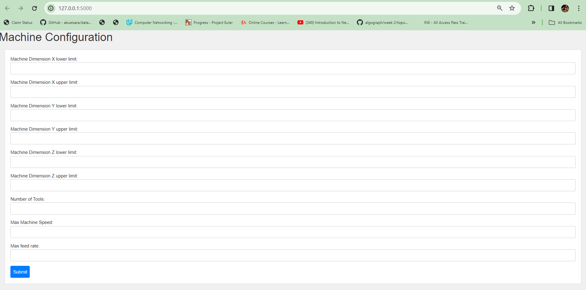
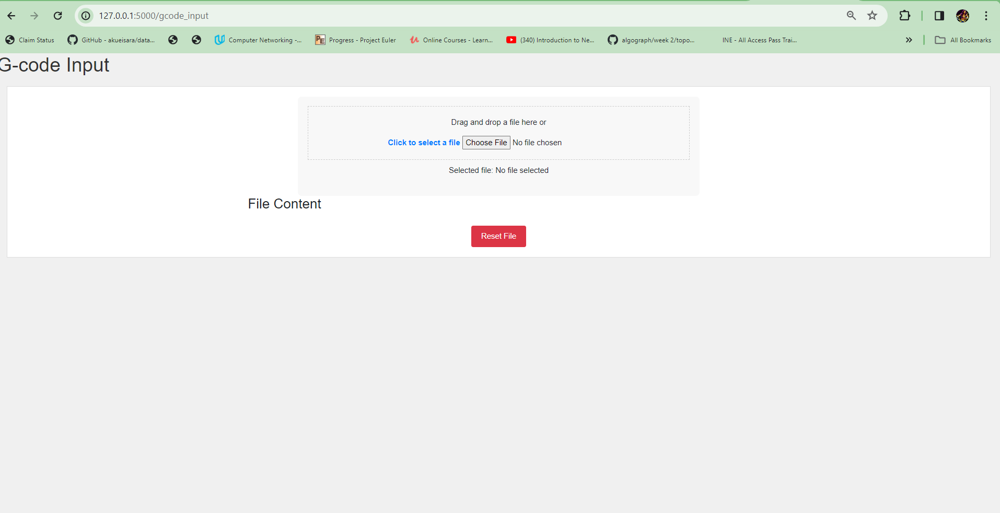
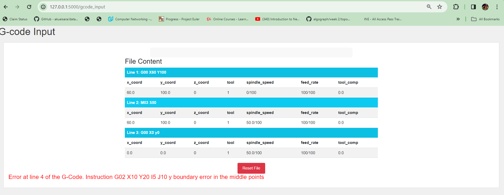
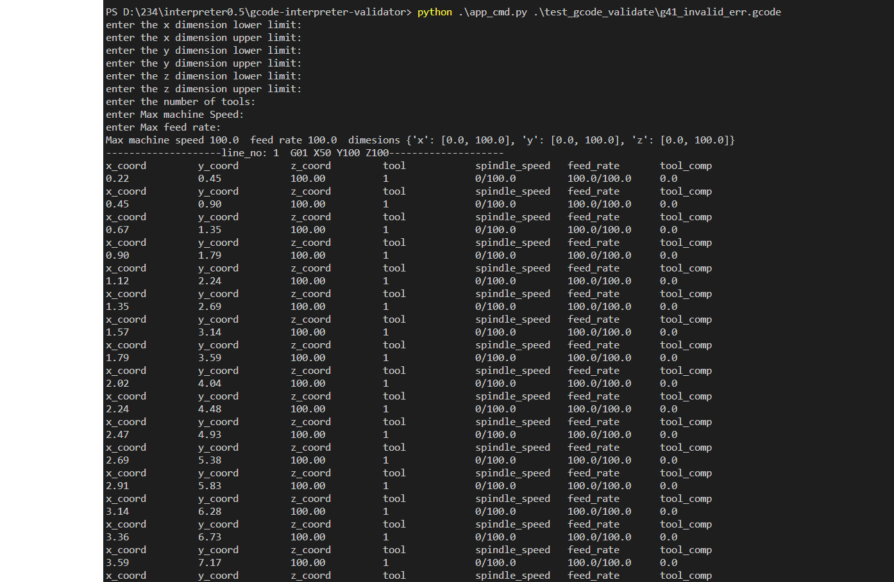

# Project Description and Purpose.
- Our project's goal is to Develop and validate firmware for CNC machines, aligning specifically with the Haas CNC standard.
- Enhance CNC machine operations by delivering tangible benefits, including improved accuracy, a more reliable machining process,
 and a reduction in the risk of errors for higher-quality outcomes.
- Develop a G-Code interpreter emphasizing CNC machine features such as linear and circular movements, spindle speed management,
  tool compensation, and setup.
- Emphasize prevention and risk mitigation to avoid issues like machine damage and erroneous paths, ensuring efficient resource utilization in machining processes.
- The project's commitment to making a significant impact on the CNC machining industry, setting elevated standards for firmware development and validation to propel the industry forward.

$${\color{red}This \space repository \space contains  \space only \space the \space final \space commits.}$$

**You can also visit https://github.com/eralcacer/gcode-interpreter-validator to find the older versions.**

# Table of Contents
- Getting Started
- Prerequisites
- Installation
- Usage
- Coverage
- Contributing
- Project Sponsor
- Acknowledgments

# Getting Started
Welcome to our project gcode_interpreter_validator, and This section will guide you through the initial setup and usage of the firmware developed for CNC machines following the Haas CNC standard.

# Prerequisites
Before you begin, ensure that you have the following prerequisites installed:
- [Python](https://www.python.org/downloads/): The project is developed using Python.

# Installation
A step-by-step guide on how to install and set up our project.
## 1. Clone the repository into your machine.
    git clone https://github.com/praneethpillarisetty/CSC234.git
    cd gcode-interpreter-validator
## 2. Run the following command to install the required modules.
``` pip install -r requirements.txt ```.
# Usage
1. ## User Interface
    ```python .\updated_app.py```.
    - open the browser and go to 'http://127.0.0.1:5000' to find the running flask application
    the following are the screen shots for the working of the UI
    ### Home_page
    
    ### gcode_input_page
    
    ### output_page
    
2. ## Command line.
    to run the command line version of the code use the following command( change the input gcode file name in the parameter as required).
    ```python .\app_cmd.py .\test_gcode_validate\g41_invalid_err.gcode```.
    ### CMD
    
    - **Note:** please find all the gcode files used for testing inside the test_gcode_validate folder if you want to test it with the custom file. create the file anywhere but please check if the passed file path is valid or not.
# Coverage
The coverage module installed is used to run all the pytest files created in this project at a time.
1. ## Run Coverage
    ```coverage run -m pytest .\Testing```.
    - **Note:** If you want to add your own test files just add the test files in testing folder and also don't forget to end the file name with "_test.py" to be recognized by the coverage command automatically.
2. ## Run Coverage report
    ```coverage report```.
    - This command allows user to check the report of all the executed pytest files.
3. ## Run Coverage html
    ```coverage html```.
    - This command allows user to check the more detailed version of the report(can check what lines are not getting executed) using the browser.
    - **Note:** The user has to open the "..\htmlcov\index.html" in the browser manually.
# Contributing
- Venkata Satya Sai Praneeth Pillarisetty (Team Lead)
- Christin Thankachen Moolamurriyil
- Enrique Alcacer
- Charitha Vadamala
- Nikitha Mandhana

# Project Sponsor
Mr. Sam Miller

# Acknowledgments
Thanks to Professor Ahmed Salem for bring such an excellent Project sponsor and gain experience in Software Verification and Validation using this project.